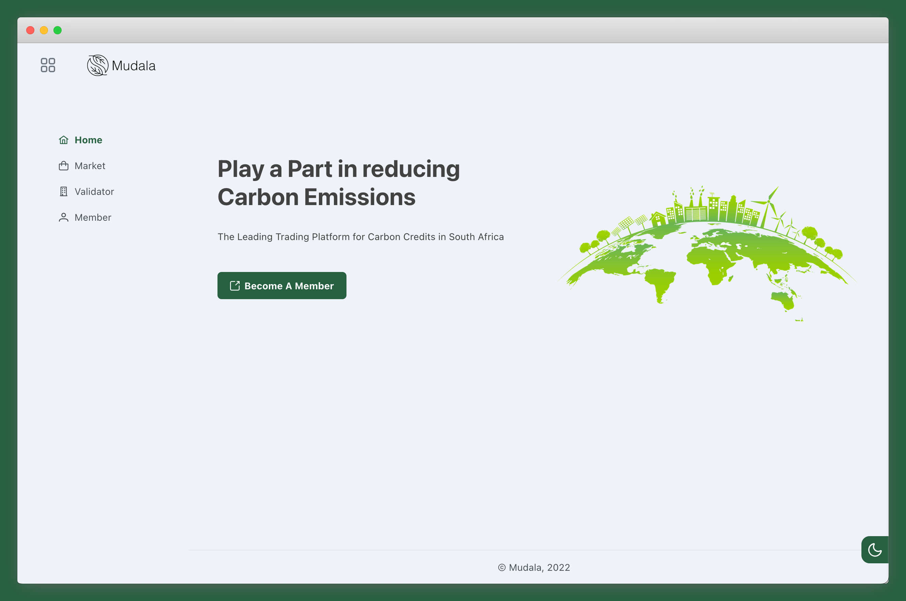

# Project-Carbon

A carbon-credit marketplace powered by the Ethereum blockchain



## Tech Stack

- `Express`
- `Vue`
- `Solidity`
- `Truffle`

## Installation

Install Ganache for local blockchain
```
Visit https://www.trufflesuite.com/ganache
``` 

Start Ganache and create an application workspace
```
Visit https://www.trufflesuite.com/tutorial
``` 
Install project dependencies
```
npm install
cd client 
npm install
```

## Starting the elements at once
## Building the whole  app

- run Ganache and start the workspace linked to the project
- compile the contracts

``` 
truffle compile
truffle migrate
```

- The command below will build frontend and start the backend
- run it from root folder

```
npm run build-app
```

- After building the app will be accessible on `https://localhost:3001`


## Alternatively starting the elements separately

### BACKEND

- Start Ganache , compile and migrate contracts as noted above and in the root folder run

``` 
npm run dev
```

- The API will be accessible on `http://localhost:3001`

### FRONTEND

- Navigate to client folder

``` 
cd client 
npm run serve
```

- The Frontend will be accessible on `http://localhost:8080`


## Compile contract

Compile and Deploy smart contract (located in contracts/) to Ganache
```
truffle compile

truffle migrate
```


## Other  Truffle commands

Scaffolding contracts

``` 
truffle create contract YourContractName # scaffold a contract

truffle create test YourTestName 

truffle compile

truffle migrate --reset
```


